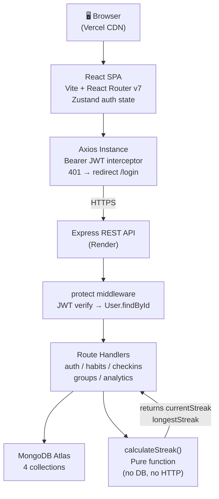
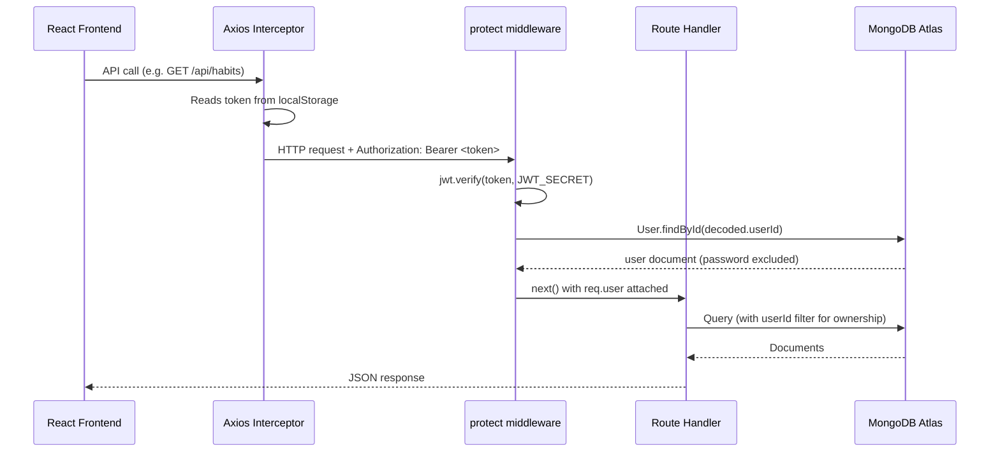
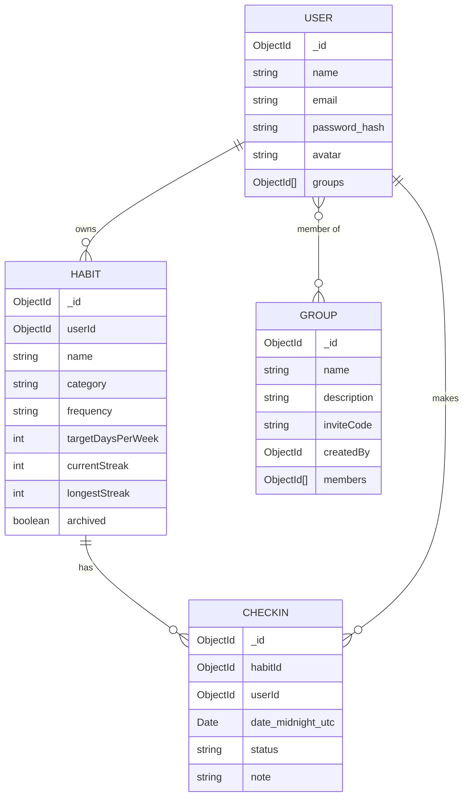

# 01 — Architecture

## System Overview

StreakUp is a **two-tier web app** with a clear separation between a React SPA and a REST API. There is no SSR, no BFF, no microservices — one backend, one frontend, one database.

```
┌────────────────────────────────────────────────────────────┐
│                         USER BROWSER                        │
│                                                            │
│   React SPA (Vite build, hosted on Vercel CDN)             │
│   ┌──────────┐ ┌──────────┐ ┌──────────┐ ┌────────────┐  │
│   │ Zustand  │ │React     │ │ Recharts │ │ Heatmap    │  │
│   │ Auth     │ │ Router   │ │ Charts   │ │ (CSS Grid) │  │
│   │ Store    │ │ v7       │ │          │ │            │  │
│   └──────────┘ └──────────┘ └──────────┘ └────────────┘  │
│            ↕  Axios (Bearer JWT in every request)          │
└────────────────────────────────────────────────────────────┘
                           HTTPS
┌────────────────────────────────────────────────────────────┐
│              Node.js / Express API (Render)                 │
│                                                            │
│   Middleware stack (order matters):                        │
│   cors → express.json → morgan → routes → 404 → errorHandler│
│                                                            │
│   Routes:                                                  │
│   /api/auth      → auth.js                                 │
│   /api/habits    → habits.js + checkins.js                 │
│   /api/groups    → groups.js                               │
│   /api/analytics → analytics.js                            │
│   /api/health    → inline (Render keep-alive)              │
│                                                            │
│   protect middleware (JWT verify) gates all non-auth routes│
└────────────────────────────────────────────────────────────┘
                           TCP
┌────────────────────────────────────────────────────────────┐
│              MongoDB Atlas (M0 free tier)                   │
│                                                            │
│   Collections:  users  habits  checkins  groups            │
│   Indexes:                                                 │
│     users.email      → unique                              │
│     habits.userId    → non-unique (query filter)           │
│     checkins.habitId → non-unique                          │
│     checkins.userId  → non-unique                          │
│     checkins.(habitId,date) → UNIQUE COMPOUND ← key index  │
│     groups.inviteCode → unique                             │
└────────────────────────────────────────────────────────────┘
```

---

## Component Map

### Backend (`backend/src/`)

```
index.js              ← Express bootstrap: middleware, route mounting, DB connect, server start
│
├── routes/
│   ├── auth.js       ← POST /register, POST /login, GET /me, PATCH /profile
│   ├── habits.js     ← CRUD + refreshHabitStreaks (lazy streak correction on GET)
│   ├── checkins.js   ← POST /:id/checkin (upsert + streak recalc), GET /:id/history
│   ├── groups.js     ← CRUD + join/leave + leaderboard (computeScore)
│   └── analytics.js  ← summary stats, heatmap data, completion-over-time
│
├── models/
│   ├── User.js       ← bcrypt pre-save hook, comparePassword method, select:false on password
│   ├── Habit.js      ← denormalised currentStreak/longestStreak, soft-delete archived flag
│   ├── CheckIn.js    ← compound unique index (habitId, date), midnight UTC policy
│   └── Group.js      ← nanoid pre-validate hook for inviteCode
│
├── middleware/
│   ├── auth.js       ← protect(): JWT verify → User.findById → req.user
│   └── errorHandler.js ← Mongoose ValidationError/CastError/duplicate-key → clean JSON
│
└── utils/
    └── calculateStreak.js ← PURE function, no I/O, 3 exports: calculateStreak, toMidnightUTC, isoWeekKey
```

### Frontend (`frontend/src/`)

```
main.jsx              ← ReactDOM.createRoot, mounts <App />
App.jsx               ← BrowserRouter, public/protected route split, AppShell layout, bootstrap()
│
├── api/
│   └── axios.js      ← Axios instance: baseURL from VITE_API_URL, Bearer interceptor, 401→redirect
│
├── store/
│   └── authStore.js  ← Zustand: {user, token, loading}, bootstrap/login/register/logout/setUser
│
├── router/
│   └── ProtectedRoute.jsx ← loading spinner while bootstrap() runs; redirect to /login if no user
│
├── pages/
│   ├── Landing.jsx        ← Public landing page
│   ├── Login.jsx          ← Form → authStore.login() → navigate('/dashboard')
│   ├── Register.jsx       ← Form → authStore.register() → navigate('/dashboard')
│   ├── Dashboard.jsx      ← Habit list, stat cards, "New Habit" modal, handleCheckin callback
│   ├── HabitDetail.jsx    ← Single habit: heatmap + check-in history table
│   ├── Analytics.jsx      ← Summary stat cards + LineChart + BarChart (Recharts)
│   ├── Groups.jsx         ← Group list, create group, join by invite code
│   ├── GroupDetail.jsx    ← Group info + leaderboard table with rank badges
│   └── Settings.jsx       ← Profile update (name, avatar URL) → authStore.setUser()
│
└── components/
    ├── Sidebar.jsx    ← Navigation links, user avatar, logout button
    ├── HabitCard.jsx  ← Habit name, streak badge, Done/Skip/Detail buttons
    ├── StatCard.jsx   ← Reusable metric card with icon + color variant
    ├── Heatmap.jsx    ← 365-day CSS Grid heatmap, month labels, day labels, hover tooltip
    └── Toast.js       ← Global notification (success/error) — vanilla JS, no library
```

---

## High-Level Architecture Diagram (Mermaid)



---

## Request Lifecycle (Every Protected Request)



---

## Database Relationships



---

## Deployment Architecture

```
GitHub repo
├── backend/   → Render Web Service
│              Build: npm install
│              Start: node src/index.js
│              Env:   MONGODB_URI, JWT_SECRET, CLIENT_ORIGIN
│              Health check: GET /api/health
│
└── frontend/  → Vercel
               Build: npm run build (Vite)
               Output: dist/
               Rewrites: /* → /index.html  (React Router SPA fix)
               Env: VITE_API_URL=<Render backend URL>
```

**Key deployment note:** Frontend and backend live on **different domains** (vercel.app vs onrender.com). This is why:
- CORS is configured explicitly with `CLIENT_ORIGIN` env var
- Auth uses `Authorization` header (not cookies), avoiding cross-domain cookie issues
- `vercel.json` rewrites all routes to `index.html` so React Router's client-side navigation works on refresh

---

## Key Architectural Decisions

| Decision | What Was Done | Why |
|---|---|---|
| **Pure streak function** | `calculateStreak.js` has zero side effects | Testable in isolation; called from both checkin route and the lazy refresh on GET /api/habits |
| **Denormalized streak fields** | `currentStreak` + `longestStreak` stored on Habit doc | Dashboard and leaderboard reads are O(1); no aggregation on every load |
| **Compound unique index** | `{ habitId, date }` unique on CheckIn | Enforces one check-in per habit per day at DB level; makes upsert safe |
| **Midnight UTC normalization** | All dates stored as `T00:00:00.000Z` | The compound index is timezone-stable; no DST drift breaks the uniqueness |
| **Separated concerns** | Routes / Models / Middleware / Utils are distinct layers | Each is testable and explainable independently |
